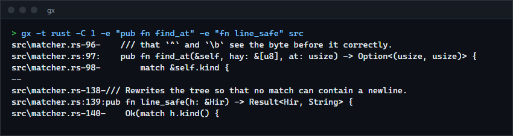
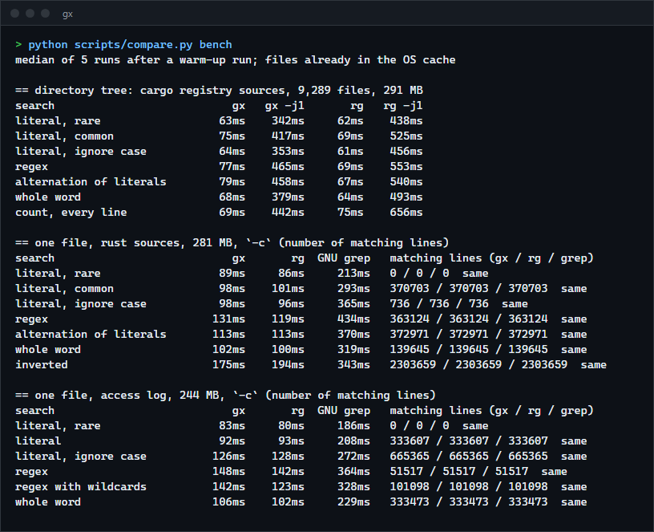

# gx

A parallel recursive grep in Rust: regex search that respects `.gitignore`, skips binary files, searches literals with SIMD and prints context, counts and colours. For people who want to see how a ripgrep-style tool is put together, with measurements against ripgrep and GNU grep.

**Status:** v0.1.0, working on Windows. Not published to crates.io; build from source. It is not a ripgrep replacement: it matches ripgrep's output on 24 real searches and is within about 15 percent of its speed, but has far fewer features (see Limits).



## Features

- Walks directories in parallel and skips what `.gitignore`, `.ignore` and hidden files exclude; `--hidden` and `--no-ignore` turn that off.
- Skips binary files (a NUL byte in the first 8 KiB); a binary file named on the command line reports `binary file matches`; `-a` searches it as text.
- Whole-buffer search: the regex engine scans a file in one call instead of line by line, and a pattern that is a plain string uses a SIMD substring search.
- `-i`, smart case `-S`, whole word `-w`, whole line `-x`, fixed strings `-F`, several patterns with `-e` or from a file with `-f`.
- Output: line numbers, `-A`/`-B`/`-C` context, `-o` matching parts only, `-c` counts, `-l` and `--files-without-match`, `-v` inverted, `-m` limit per file, colours, deterministic order with `--sort`.
- File selection by glob (`-g '*.rs'`, `-g '!vendor'`) and by type (`-t rust`, `-T py`, `--type-list`).
- Large files are memory-mapped; the file is never loaded into memory.
- `--stats` prints files searched, bytes and throughput. Exit status is 0 for a match, 1 for none, 2 for an error.

## How to install

Requires a recent stable Rust (built and tested with 1.98.1).

```sh
git clone https://github.com/r3clusionn/grep-alternative
cd grep-alternative
cargo install --path .
```

This installs the `gx` binary. Or run it in place with `cargo run --release -- PATTERN`.

## How to use

```sh
gx TODO                       # search the current directory
gx -i 'fn \w+_test' src       # regex, ignoring case, in src
gx -t rust -C 2 unsafe        # Rust files only, two lines of context
gx -c -g '*.toml' version     # count matching lines per file
gx -e error -e warn app.log   # lines with either word
gx -l --sort TODO             # names of files with a match, in path order
some-command | gx pattern -   # standard input, only when `-` is given
```

| Option | What it does |
|---|---|
| `-e PATTERN`, `-f FILE` | A pattern (repeatable) or patterns from a file, one per line. |
| `-F`, `-i`, `-S`, `-w`, `-x` | Literal strings, ignore case, smart case, whole words, whole lines. |
| `-v`, `-c`, `-l`, `--files-without-match`, `-o`, `-q` | Invert, count, list files, list files without a match, matching parts only, silent (exit status only). |
| `-A N`, `-B N`, `-C N`, `-m N` | Context after, before, around; stop a file after N matching lines. |
| `-N`, `-H`, `-h` | No line numbers; always or never show file names. |
| `-g GLOB`, `-t TYPE`, `-T TYPE` | Include or exclude by glob or file type. |
| `--hidden`, `--no-ignore`, `--follow`, `--max-depth N` | Widen or narrow the walk. |
| `-j N`, `--no-mmap`, `--sort`, `--color WHEN`, `--stats`, `--crlf`, `--include-zero` | Threads, read instead of map, sort by path, colours, summary on stderr, `$` before `\r\n`, show zero counts with `-c`. |

By default line numbers are shown and the file name is shown when searching more than one file or a directory. Files with no match are left out of `-c` output, as in ripgrep.

## How it works

- **Searching a whole buffer is only correct if no match can cross a line break.** The pattern is parsed to its syntax tree and rewritten before it is compiled: every character class (`\s`, `[^x]`, `(?s).`) has the newline removed, a literal newline is rejected with an error, and `\A` and `\z` become line anchors. Then one regex call can scan megabytes, with the engine's own prefilters and SIMD, and each match is mapped back to its line with `memchr`.
- **Literals skip the regex engine.** A pattern that parses to a plain string goes to `memchr::memmem`, which uses SIMD. Case-insensitive, word and line modes go through the regex engine.
- **Several patterns** become one alternation, which the regex engine compiles to a multi-pattern matcher.
- **Inverted search** finds the next matching line and selects every line before it.
- **Context** is printed by tracking where the last printed line ended: lines between two matches are either context or skipped, and `--` marks a gap, also between files.
- **Parallelism.** The directory walk runs on a thread pool (the `ignore` crate), and each thread searches the files it finds, building each file's output in a buffer that is written under one lock so lines from different files never interleave.
- **Reading.** Files of 1 MiB or more are memory-mapped; smaller ones are read into a reused buffer. If another process truncates a mapped file while it is searched the read can fault; `--no-mmap` avoids that by reading the file.

## Measurements

Release build (LTO), ripgrep 15.2.0, GNU grep 3.0 (Git for Windows), on an Intel Core i9-14900KF (24 logical CPUs), Windows 11, Rust 1.98.1. Each figure is the median of 5 runs after a warm-up run, with the files already in the OS cache. `scripts/compare.py bench` reproduces them. The tree is the cargo registry sources on this machine: 9,289 files, 291 MB. The two single files are all `.rs` files of that tree joined into one 281 MB file, and a generated 2,000,000-line web access log of 244 MB (`../11-log-analyzer/scripts/gen_log.py`).



- **Same answers.** On every single-file case all three tools report the same number of matching lines, and on 24 searches over the tree (literals, regexes, `-i`, `-w`, `-S`, `-o`, `-C`, `-l`, `-c`, `-g`, `-t`, `-x`, `-v`, `-m`) `gx` prints exactly the same lines as ripgrep, up to a 1,021,826-line result.
- **Speed.** On the tree and on single files `gx` and ripgrep are within about 15 percent of each other: `gx` is slower on regexes (131 against 119 ms on the Rust sources, 142 against 123 ms for the wildcard regex on the log) and level or slightly faster on literals, inverted search and counting every line. Both are 2 to 4 times faster than GNU grep on a single file.
- **Single thread.** With `-j 1` on the tree `gx` took 342 to 465 ms and ripgrep 438 to 656 ms. I did not profile why ripgrep is slower there, so treat that as a measurement and not as a claim that `gx` is better built: ripgrep does more per file (for example encoding handling) that `gx` does not do.
- **Why it is not faster than ripgrep.** Both use the same regex engine and the same directory walker, so the heavy lifting is shared. Where `gx` is behind, the likely cause is the years of tuning in ripgrep's searcher; I did not investigate further.
- GNU grep was run with its output on a pipe. Writing to the null device makes it stop at the first match, which makes it look instant, and an earlier version of the benchmark script measured exactly that before this was noticed.

## Verification

- `cargo test --release`: 18 unit tests, 16 command-line tests, 2 differential tests and a doc test.
- The differential tests build 8,000 random texts and patterns (classes, quantifiers, anchors, `\b`, `\A`, `\z`, alternation) with random `-i`, `-w`, `-x`, `-v` and context settings, and compare the selected lines and the exact printed output with an oracle that splits the text into lines and asks the `regex` crate about each line. I checked that the oracle can fail by breaking the code three ways (leaving the newline in classes, removing the guard against a phantom line after the final newline, not rewriting `\A` and `\z`); each was caught.
- `scripts/compare.py check` diffs `gx` against ripgrep on 24 searches over the cargo registry sources. All print the same lines, except for one ripgrep test file (`sherlock-nul.txt`, a NUL byte after the first 8 KiB), which is excluded from the comparison and described in Limits.

## Limits

- Binary detection looks only at the first 8 KiB. ripgrep notices a NUL byte anywhere and stops searching the file; `gx` searches the whole file, so a file with a late NUL is searched and may print binary data.
- One thread per file: a single large file is not split across threads.
- No encoding detection (UTF-16 files are not transcoded), no compressed files, no multiline search (a pattern cannot match across lines), no replace, no JSON output, no config file, no PCRE.
- Only tested on Windows. The code has no Windows-specific parts, but it was not run on Linux or macOS.
- `.gitignore` is honoured inside a git repository (a directory with `.git`), like ripgrep.

## License

MIT (see `LICENSE`).
